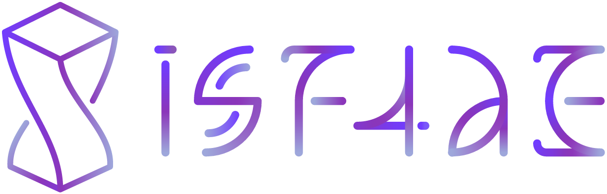
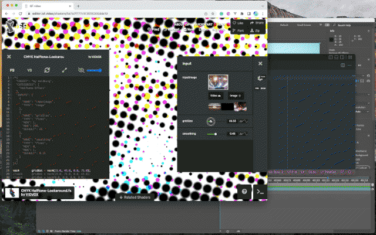

<div align="center">
  
  <br>
  <h1>ISF4AE - Interactive Shader Format for After Effects</h1>
  <br>
  
  <br>
  <br>
</div>

After Effects plugin to allows you to use GLSL code written in the [Interactive Shader Format](https://isf.video/) as an effect. **In short, it's an effect that lets you build effects by yourself** -- without struggling with the complicated C++ SDK.

### Supported Environments

The plugin has been confirmed to work in the following environments. However, it should generally work in CC 2022 or later on any macOS and Windows:

 - CC 2023 on macOS Monterey (Apple Silicon, Intel)
 - СС 2023 on Windows x86_64

---

## Additional ISF Specification

Since ISF was originally designed for real-time purposes, such as VJing, it has some limitations that do not align with After Effects' characteristics. This section describes how the plugin interprets ISFs and interoperates with After Effects. The following explanation assumes that you have already understood [the specification of ISF](https://github.com/mrRay/ISF_Spec/).

### Limitations

Currently, the plugin does not support several types of inputs, [persistent buffers](https://github.com/mrRay/ISF_Spec/#persistent-buffers), or custom vertex shaders. It also has a maximum of 16 inputs (excluding `"inputImage"` and reserved uniforms `"i4a_"` as mentioned [later](#isf4ae-specific-uniforms)).

### Supported Input Types

Note that `"event"`, `"audio"`, and `"audioFFT"` are not yet supported currently.

- `"bool"`: displayed as a checkbox.
- `"long"`: displayed as a dropdown list by default. But if no `VALUES` key exists, an integer slider between `MIN` and `MAX` is used instead.
- `"float"`: displayed as a slider by default. You can specify a type of UI by setting either constant below as a property `"UNIT"`.
  - `"default"`: just a scalar; the value will be passed as it is.
  - `"length"`: represents a length in px. It is also displayed as a slider, but the value will be mapped from 0...<layer's width> to 0...1 when passed to a shader.
  - `"percent"`: displayed with "%" suffix. The value will be bounded as a uniform divided by 100. For example, 50% in the Effect Controls panel will be passed as 0.5 to the shader.
  - `"direction"`: displayed as an angle input, and the range of value will be mapped so that radians in OpenGL coordinate (Y-up right-handed) match the direction that the rotary knob UI is pointing. The internal conversion from AE to GLSL is equivalent to the formula `radians(90 - value)`. It would be suitable for representing an absolute angle that should be consistent visually between the knob UI and the output.
  - `"angle"`: similar to the above, displayed as an angle input but uses a conversion formula `radians(-value)` instead. It is suitable for representing relative angle changes -- hue offset of HSL adjustment, for instance.
- `"point2D"`: represents a position in px. It will be mapped to OpenGL's normalized coordinate; (0, 0) at the bottom-left corner, (1, 1) at the top-right corner of the layer.
- `"color"`: displayed as a color picker.
- `"image"`: displayed as a layer reference input.

### Other Addotional Properties for Inputs

"MIN" and "MAX" only affect the range of slider UI in the Effect Controls panel and users can still set the values outside of the range. To forcibly constrain the value within the range, you can use the plugin's custom properties `"CLAMP_MIN"` and `"CLAMP_MAX"` in a boolean value.

### ISF Built-in Uniforms

Here is how the plugin determines the value of ISF built-in uniforms

| Uniform      | Description                                                                                                                                                 |
| ------------ | ----------------------------------------------------------------------------------------------------------------------------------------------------------- |
| `TIME`       | When you load a shader referring to this uniform, the hidden parameters appear in the Effect Controls panel. You can use either layer time or custom value. |
| `TIMEDELTA`  | Always set to a value that equals to an expression `thisComp.frameDuration`                                                                                 |
| `FRAMEINDEX` | Equivalent to `TIME / TIMEDELTA`, or `TIME * fps`.                                                                                                        |

### ISF4AE-specific Uniforms

Inputs with names beginning with `i4a_` are reserved by the plugin. When you define the inputs shown below, the plugin automatically binds values that can be useful for accessing the status of the Preview panel from a shader.

| Name                                               | ISF Type  | Description                                                                                                                                                                                                                                                                                                                                                                                                                                      |
| -------------------------------------------------- | :-------: | ------------------------------------------------------------------------------------------------------------------------------------------------------------------------------------------------------------------------------------------------------------------------------------------------------------------------------------------------------------------------------------------------------------------------------------------------ |
| `"i4a_Downsample"`                                 | `point2D` | Downsampling factor in Preview panel. For instance, the value is set to `(0.5, 0.5)` in half resolution.                                                                                                                                                                                                                                                                                                                                         |
| `"i4a_CustomUI"`                                   |  `bool`   | Set to `true` when the effect requests an image for [Custom Comp UI](https://ae-plugins.docsforadobe.dev/effect-ui-events/effect-ui-events.html?highlight=custom%20comp%20ui#effect-ui-events), which is only visible when you click and focus the effect title in the Timeline / Effect Controls panels. The pass returned by a shader will be overlayed onto the result layer.<br>**NOTE: you cannot refer to any image inputs on this pass.** |
| `"i4a_UIForegroundColor"`<br>`"i4a_UIShadowColor"` |  `bool`   | For referring to After Effects' current color scheme to draw Custom Comp UI. Only available when `i4a_CustomUI` is `true`.                                                                                                                                                                                                                                                                                                                          |
| `"i4a_UIShadowOffset"`                             | `point2D` | Same as above. Unlike user-defined inputs, the range of value is not normalized and will be passed in absolute px.                                                                                                                                                                                                                                                                                                                               |
| `"i4a_UIStrokeWidth"`<br>`"i4a_UIVertexSize"`      |  `float`  | Same as above. Passed in px.                                                                                                                                                                                                                                                                                                                                                                                                                     |

---

## How to Build

1. Download [After Effects Plug-in SDK 2022 Mac - Oct 2021](https://adobe.io/after-effects/).

2. Clone this repository, including its submodule, by following the steps below:

```bash
# At the root folder of SDK
cd Examples/Effect
git clone https://github.com/bskl-xyz/ISF4AE.git
cd ISF4AE
git submodule update --init
```

### On Mac

3. Open the Xcode project and build it. The binary will automatically be copied under `/Library/Application Support/Adobe/Common/Plug-ins/7.0/MediaCore/`.

### On Windows

3. Set environment variable `AE_PLUGIN_BUILD_DIR` to `C:\Program Files\Adobe\Common\Plug-ins\7.0\MediaCore`.

4. Copy the `glew32.dll` dynamic library from `VVISF-GL\external\GLEW\win_x64` to `C:\Windows\System32\` folder.

5. Apply VVISF-GL patch in the root of this repo:

```bash
git apply VVISF-GL-Submodule.patch
```

## License

This plugin has been published under an MIT License. See the included [LICENSE file](./LICENSE).

## Similar Projects

- [PixelsWorld](https://aescripts.com/pixelsworld/): Scripting environment supporting Lua, GLSL, and shadertoy.com.
- [Pixel Blender Accelator](https://aescripts.com/pixel-bender-accelerator/): A plugin to run [Pixel Blender](https://en.wikipedia.org/wiki/Adobe_Pixel_Bender), a shader format supported in Adobe products previously, in modern versions of AE.
- [AE-GLSL](https://github.com/cryo9/AE-GLSL): Working-in-progress repository by [cryo9](https://github.com/cryo9), which hinted me how to interoperate OpenGL and After Effects SDK.
- [AE_tl_math](https://github.com/crazylafo/AE_tl_math): an plugin project which allows users to write math expression for each pixels, or GLSL shaders. It also bundles a nice pane to edit and update code in realtime.

## Acknowledgments

- [mizt](https://github.com/mizt): One of the visual artists having an ability to buidl a plugin for After Effects. We've traded lots of tips on AESDK.
- [0b5vr](https://0b5vr.com): He also gave me many advices for handling OpenGL.
- [Patricio Gonzalez Vivo](https://github.com/patriciogonzalezvivo): One of my reason for being hooked on shaders is his cool project [The Book of Shaders](http://thebookofshaders.com). This plugin once aimed to support the format of [its editor](http://editor.thebookofshaders.com/).
